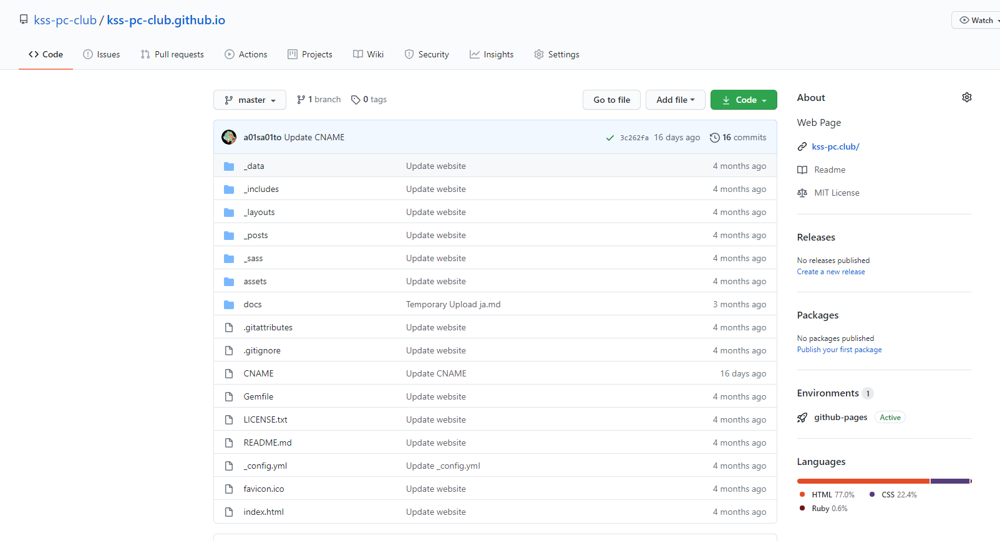
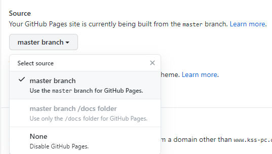
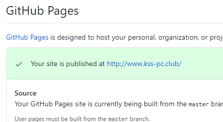
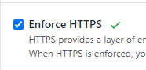
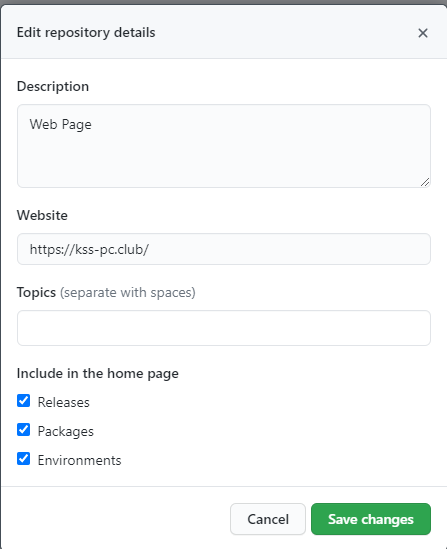

1. リポジトリページを開きます。   
2. 上部「Settings」をクリック。   
3. 左の「Pages」をクリック。「Source」を自分が公開したいもの（ここでは「`master branch`」）に変更します。   
4. 「Custom domain」に自分が申請したドメインを入力します。   
5. スプレッドシートに記入し、部長に設定を変更してもらいます。 スプレッドシートの URL は Slack から。  
6. 「Your site is published at ～」と表示されているのを確認します。   
7. このままでは常時 TLS 化されていないので、「Enforce HTTPS」をオンにします。   
8. 任意で、リポジトリページに表示される、プロジェクト URL を変更できます。 
   

おわり。
