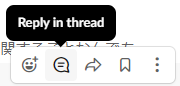
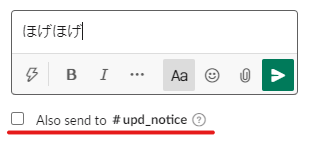
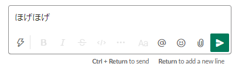

## チャンネルについて

### 命名規則

チャンネルの頭には、3 文字のアルファベットがついています。

- gen: Slack に加入した時から入っているチャンネル（general）
- upd: 更新情報（update）
- prj: プロジェクト（project）

この 3 文字の後に、"`_`"が続き、英語で概要が続きます。区切りが必要な際には、"`-`"を使う。 
例: #gen_chat→ 初めから入っている雑談チャンネル

#### 特殊例

- `(4桁の数字)-students`: 学年ごとのチャンネル（数字は入学した西暦年度）

### Topic および Description

Topic: 説明の概要を記入。
Description: さらに詳細の説明が必要であれば記入。

## 会話時

会話時は、なるべく "Thread" 機能を利用し、ダイレクトでの投稿は避けてください。 
また、Slack は LINE とは違います。文節区切りで文章を送らず、まとめて送ってください。 
これは、回答の通知が必要ない人への通知を防ぐことに加え、チャンネル内で遡ってメッセージ検索する際に見やすくしたり、可読性を向上させたりするためです。 
なお、Slack は LINE とは違い、誰か他の人が文を打っているときに「〇〇 is typing...」といった表示が出ます。返信する際に文章を打っている人がいたら、待ってあげるのも 1 つの選択肢かもしれません。

【スレッド機能とダイレクト投稿】 

- スレッド 
   をクリック 
  ↓ 
   
  （※`Also send to #○○` が表示されている）

- ダイレクト 
   
  （※`Also send to #○○` が表示されていない）

【文節区切り】 
例えば「いやでも、A より B がいいと思うな。それは C だから。」といった文章を送りたいとき、 
「いやでも」「A より B がいい」「と思う」「C だから」 
といった具合に、恐らく素早いレスポンスのために文を区切ることを指しています。
