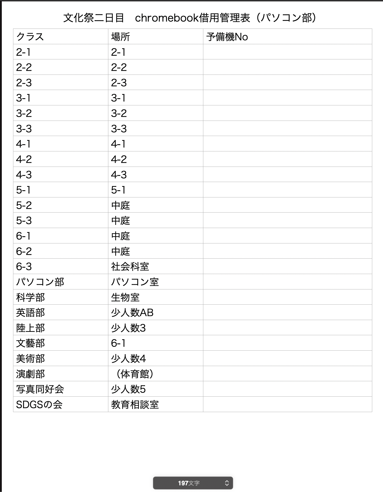
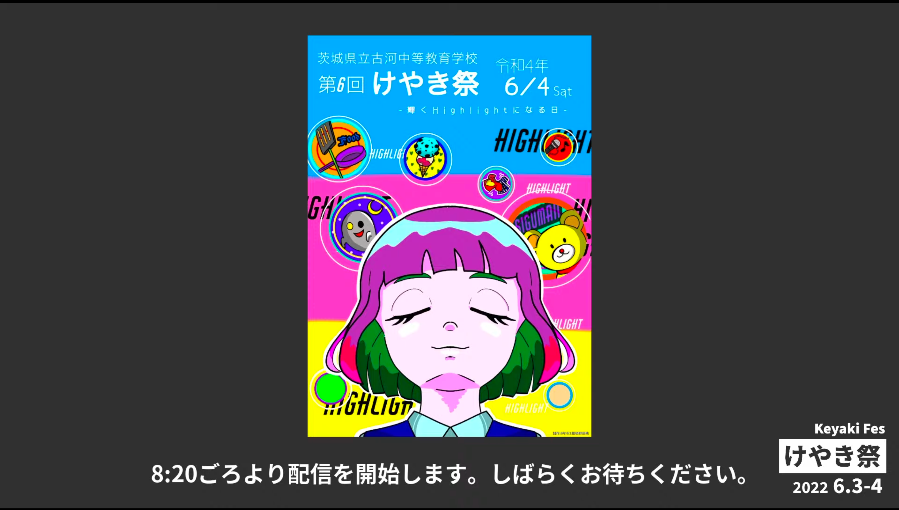
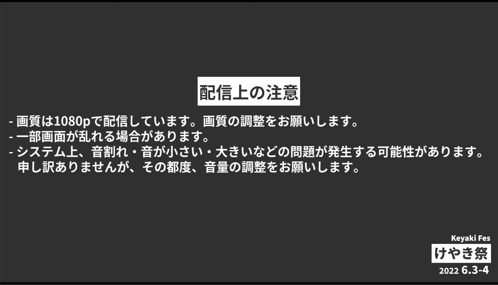
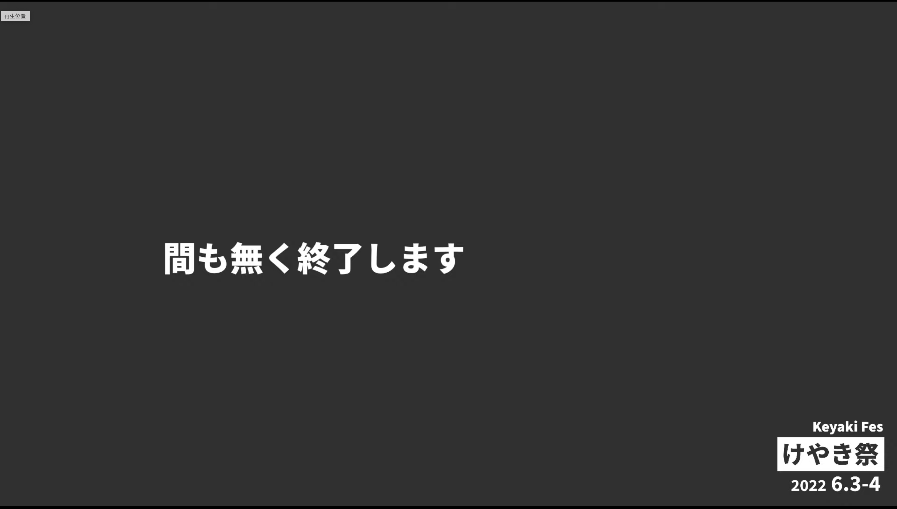

# はじめに

こんにちは。6 期生（現 5 年次）の**eno1220**です。

今回は、第 6 回けやき祭で行ったことをまとめて紹介しようと思います。部長である Ryoga.exe の執筆した記事も併せてご覧ください。

# 振り返り

部内引き継ぎ用に執筆した「第 6 回けやき祭の反省」および、文化祭実行委員会に提出した「引き継ぎメモ」から要約して執筆していきます。文体が統一されていないことがありますがご了承ください。

また、学校内の生徒及び教員は、前者はパソコン部に、後者は文化祭実行委員会に保管されていますので、閲覧したい場合はお声がけください。（eno1220 に声をかけていただければ、どちらもお見せできます）

## 全体として

Ryoga.exe も書いているように、**計画性** が全くなかった点が 1 番の反省です。前日に配信の準備を始めるなど、危機管理や準備への意識が全くありませんでした。なんとかなってよかったですが、本当にいろいろと危なかったです。

## クラス企画（劇）

前半はいろいろと休んでしまい、ほとんど関わっておらず、後半はパソコン部の仕事で全く関わることができず迷惑をかけてしまいました。すみません。

今年度のクラス企画は、有名映画やアニメの脇役を主役にした演劇、ということで、私のクラスでは「ハリーポッター」の演劇を行いました。また、感染対策や定時での実行（これは前期生の給食の関係だそうで）を行うことを目的として、全クラスがアテレコ（事前録音）で実施することになりました。

##### 自分がやった点

私は、音源の録音と初期編集を担当しました。録音は自分の macbook を使用して実施しました。仮録音のつもりでしたが、思った以上にノイズを拾わなかったので、本番用に採用されました。

編集メンバーは私の他には同じ部活の sapph や hnm_md が担当してくれていて、使用しているパソコンが windows や mac と異なる OS だったので、どちらでも使用できる audacity を使用して編集を行いました。カットやノイズ除去、BGM の追加を行い、残りは二人に任せてしまいました。（その後、揉めに揉めた結果、大変だったようなので、申し訳ない気持ちです）

これは劇に限らない話題ですが、弊校では Google Workspace のアカウントが全生徒、全教員に割り当てられており、データ共有には重宝しました。

##### 改善点

各クラスで音源を制作している以上、録音機材や編集力でクラス間の差が出てしまいました。具体的には、音源の完成度やノイズの量、音質などの点です。来年度以降の改善点として、

- 放送室など、録音場所の提供
- 音源編集のレクチャーや情報共有

があると思っています。なるべく全クラスが幸せにできるようにしていきたいですね。

## 模擬店

私のクラスでは、焼きそばとフランクフルトの販売を行っていました。それぞれ、{先生のお名前}風ソースパスタとシェフのこだわりソーセージ〜トマトソース添え〜という名前にしていました。~~名前詐欺にも程があるだろ~~

私は、当日の販売を担当していました。食券制でしたが、それを知らない生徒がたまにいたり、列が混ざってしまったりしてしまいました。案内が足りないのは良くないですね...おおむね順調に捌いていたのですが、たまに大量注文があってスケジューラが壊れていたのが趣深かったです。

## 部活動（パソコン部）

### 部誌

Ryoga.exe が声をかけてくれたので、参加することにしました。テーマは wikipedia を適当に探していた時に見かけた ZigLang の基本文法の解説を行うことにしました。詳細は、[こちら](https://repos.kss-pc.club/book-2022/book-v.pdf) をご覧ください。

締切ぎりぎりまで執筆をサボっていたことやドキュメントの読解をやっていなかったこともあり、非常に低品質な記事を書いてしまいました。締め切りにも遅れてしまいました。Ryoga.exe に大変な迷惑をかけてしまったこと、反省しています。

執筆時には、Zig の壊れたコードを直すことで学んでいく教育用リポジトリである[ziglings](https://github.com/ratfactor/ziglings)に大変お世話になったのでこちらにも記しておきます。

今年は Vivliostyle を使用して組版をしましたが、来年以降もいろいろな組版システムを試してみようと考えています。現在注目しているのは、開発中の[twight](https://logmi.jp/tech/articles/325476)とかですかね。完成を楽しみにしています。それから、今年度は 5 年次以上の生徒のみの参加に留まってしまったので、来年度以降は低学年の部員にも参加できるようにしていきたいです。（弊部には Scratch のプロなどが在籍しているのでぜひ書いていただきたい...）

### 個人展示

毎年（といっても、今回はコロナの影響で 3 年ぶりですが）パソコン部では各部員が制作した展示物を展示しています。低学年は Scratch で制作したゲーム、高学年は自作の音ゲーや web アプリなどを展示することが恒例になっています。

私は今回、「KSS PC CLUB QUIZ CONTEST 2022」を制作しました。Atcoder のパロディー? の web クイズアプリです。部誌に関連する話題や、情報の話題、趣味であるアイドルの話題を掲載しました。

制作は 1 週間前の土曜日の深夜になってようやく開始し、5 時間で完成させたものなのでクオリティが高くありません。計画性がなさすぎます。フロントは Pug、バックは Node.js、デザインは BootStrap v5 で構成されていて、Heroku でホスティングしています。

制作物の説明書きは、GoogleForm で Ryoga.exe が集めていましたが、Ryoga.exe の負担が凄そうだったので、来年度以降は自分でやってもらおうかな...

### KSS Fes Monitor

詳細は Ryoga.exe の記事をご覧ください。

2022 年の初めくらいに Ryoga.exe にデザインのリファクタ案を提出していたのですが、一般公開が中止になったこともあって、制作を止めていました。5 月になって、実行委員会から感染対策として導入の依頼があったので、今年度のリファクタは諦めて運用することになりました。

Firebase の Cloud Firestore をデータベースとして使用しているのですが、各模擬店の情報を手入力することになってしまい辛かったです。ミスの温床なので改善していきたいですね。

入力を行うために、chromebook を各模擬店へ配布しました。（スマホ利用が原則禁止されていたため）しかし、配布の必要に気づいて、計画して借用書を出したのが前日の夕方だったので、部員や実行委員会、情報管理部に迷惑をかけてしまいました。計画性...

今年の模擬店は 24 店舗あったので、chromebook24 台借用し、当日の朝に各模擬店へ配布しました。配布を行うのに 2 時間かかってしまい、開始ギリギリになってしまった上、各模擬店への連絡をきちんとしていなかったので chromebook を使用していなかったクラスも見受けられました。

このとき、以下のような管理表を 2 枚作って、クラスへ配布した chromebook の管理番号を控えました。こうすることで、先生へ使用したものの報告と、返却管理が番号を照合するだけでいいので楽でした。回収も番号で管理するだけなので、パソコン室に置いていくだけ（人員が足りなかったので）で済んだので楽でした。

##### 改善点

- Ryoga.exe も書いていますが、一部模擬店で待ち時間更新をしているか微妙でした。リマインダーやリハーサルを行うなどしておく必要がありそうです。
- クラスの代表者に取り扱い方の説明を行いましたが、各クラスの生徒が待ち時間モニタの存在を知らない様子が見受けられました。全生徒への周知も必要かな..?
- ChromeBook を当日朝に 25 台近く配布するのは非効率的です。来年度は各自で準備してもらうなどしましょう。

### 配信

文化祭実行委員ではないのですが、引き継ぎの意味も込めて Ryoga.exe のお手伝いをしようといたら、全てをやることになってしまいました。開始まで 20 時間の段階で。計画性...

#### 概要

弊校は全生徒 720 名が在籍していますが、コロナ感染対策でクラス企画（劇）、有志発表を行う体育館には上限 360 名とされていたため、その他の生徒には動画配信を行うことになりました。前半と後半でメンバーを入れ替える形で全員が体育館で楽しむことができるようにしました。

#### 音声

音声は、体育館の放送室にあるミキサーの録音用出力から取得しました。録音用出力からはマイク・CD・USB などの入力音声を取得できたのでその音声を配信しました。（つまり、スピーカから出力される音声と同じ音をとることができています）残念なことに体育館の観客の手拍子や反応を配信に載せることができず、臨場感に欠けてしまいました。来年以降の解決策を検討しています。

また、配信に載せる際に OBS でフィルタなどで音量を下げたのですが、それによって音が割れてしまったり、音がこもるなどの事象が発生してしまいました。解決策は発見できず、来年度の課題となってしまいました。

ナチュラルに入力音量を下げてフィルタなしで出力すればいいんですかね...？有識者の方のご意見をお待ちしています。

（以下のコメントがありました）

> 同じ音量のフィルタをかけていると、例えば吹奏楽の低音パート、バスや打楽器系が聞こえない、女声の声の高音部分が音割れするという現象が起きてしまいます。う〜ん、難しいですね...
>
> そして、これはマイクの性能にもよります。

##### 映像

配信では、情報管理部のもっているビデオカメラを使用させていただきました。レンタルしたキャプチャボードが一つのみだったので、一つのカメラしか使用することができませんでした。予算が不足していたとのことだったので仕方ないですね...

カメラは給電しながらの撮影ができないタイプだったので、バッテリーを交換しながらの配信でした。バッテリー切れギリギリになってしまいヒヤヒヤしましたが、なんとか持ってくれていてよかったです。映像の画質はよく、1080p で配信できた他、暗い空間でも映像が綺麗に撮ることができていてよかったです。

##### 配信ソフト

今回は定番の OBS を使用しました。設定は以下の通りです。

> 画質: 1980×1080
> FPS: 30
> エンコード: Apple VT H264 ハードウェアエンコーダ
> ビットレート: 4500kbps

音声ケーブルと映像ケーブルを Ryoga.exe や情報管理部、部活から借用して USB でパソコンに接続しました。機材は Apple M1 MacbookAIr(2020 late)でしたが、重くならず快適に配信できました。充電の減りがすごかったけど...

##### ネット環境

今回の 1 番の敵でした。以前から、体育館のネット環境は劣悪だったのは既知の事実でしたので、Ryoga.exe が先生方に頼んで LAN ケーブルを導入していただき、接続したルーターを配信場所そばに設置しました。

紆余曲折あったのですが（ここに記述できないのが残念ですが）、結果としてネット環境が改善しました。

テストを行った結果、上り 200Mbps ほどのスピードがでたため、快適な配信ができました。~~私のうちもこうなりませんか？~~

##### 配信方法

Youtube Live で実施しました。当初は GoogleMeet でしたが、Ryoga.exe の交渉の結果このような形になりました。ありがとうございます。

チャンネルは KSS PC Club のチャンネルを使用、動画は限定公開でしたので、部活で運用しているシステムで短縮 URL を作成し共有しました。

##### 背景

前日に作成しました。時間がなかったのでシンプルな形で制作しましたが、来年はリッチにやりたいですね。

#### 配信当日

配信準備のため早めに登校し、正常に配信できることを確認して配信を開始しました。私が配信を、Ryoga.exe がその場での音声・映像の確認、nagaso.cpp が別室での確認を行いました。体育館内部は爆音が流れているので、音の確認が難しく、各方面へ迷惑を欠けてしまいました。（具体例として、鼓膜を破壊しかけるなど）申し訳ありませんでした。

#### 改善点

- カメラ一台は迫力に欠けるため、複数台導入をしたい。
- 音質が全体的に壊滅的であったので、音質の向上を行いたい。
- 観客の反応が配信の視聴者に伝わらず、雰囲気が伝わらないため観客の反応を取れるようにしたい。
- 音質の確認をその場で行うため、遮音性の高いイヤホンを導入したい。
- 各発表での音質の差が大きかったため、差がないようにサポートしていきたい。
- テロップを導入し、楽しい配信を制作したい。

### そのほか担当したこと

- 部活の広告
- シフト制作
- パソコン室の準備
- 後輩たちの指導

## 反省

それぞれのパートでも書きましたが、さまざまな反省点がありました。来年度に生かしていきたいと考えています。

また、さまざまな作業を Ryoga.exe に任せきりにしてしまいました。感謝すると共に申し訳ない気持ちでいっぱいです。部員みなに共有して、任せきりにはしない仕組みを作っていきたいと考えています。

Ryoga.exe にはさまざまなお仕事をしていただきました。本当にありがとうございます！

<small>Ryoga.exe の仕事一覧を求めているのですがなかなか彼は提出してくれません。書いてくれませんかねぇ</small>

その他反省点は、公開できないことが多いため冒頭で記したような記事をご覧ください。校外の方はごめんね！

## 来年度やってみたいこと

改善点に加えて、来年度やってみたいことを記します。あくまでも個人の意見で、文化祭実行委員会の見解ではありません。

- ロゴ制作 - 他校の文化祭のようにロゴやアイコンのデザインを作成してみたいと考えています。
- パンフレットデジタル化 - 制作フローに無駄が多く、自動化しやすいようなので自動化を検討してみたいです。
- WEB サイト制作（一般向け/校内向け）- 来年度は一般公開ができる可能性があるので、一般向けサイトを制作し情報提供をできるようにしたいです。また、校内向けへも制作し、情報共有や書類共有を効率化したいです。
- 実行委員会との連携強化 - 準備を円滑に行うことや運営責任の所在をはっきりさせたいと考えています。

後輩たちに引き継ぐためには、来年度だけできる内容にして運営をしていくべきではありません。持続可能な運営ができるよう心がけていきたいです。
