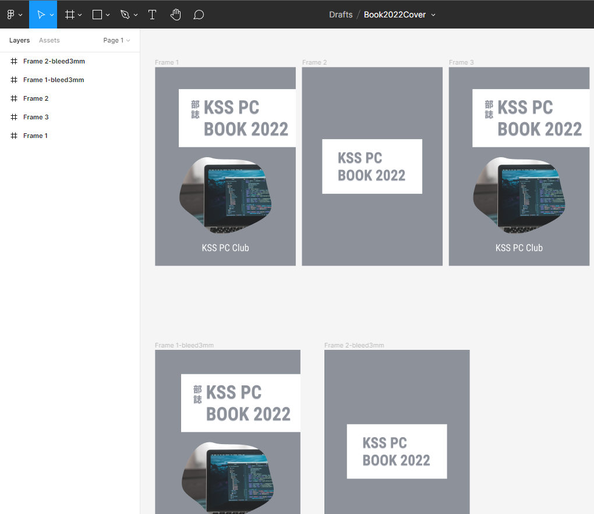
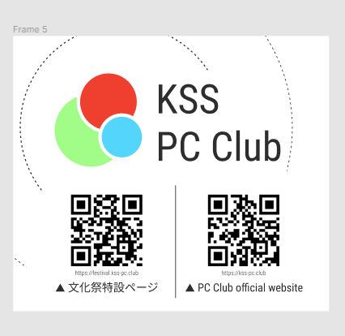
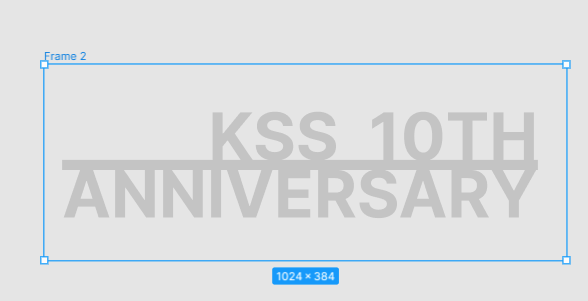
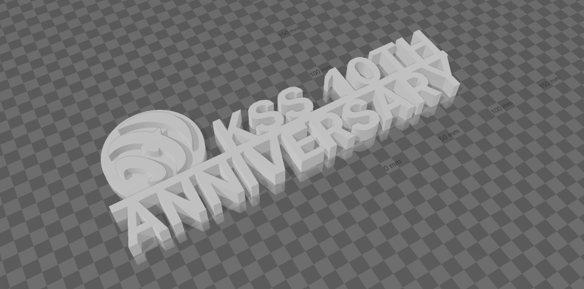

# はじめに

こんにちは。2021/2022 部長の **Ryoga.exe (KSS 5th)** です。

今回は第 6 回けやきが開催され、パソコン部は 3 年ぶりとなる模擬店での展示を行いました。
また、今年度からの初めての試みとして、部誌を作成しました。

また、私は文化祭実行委員の一人として運営に参加しました。

# 当日の模擬店の様子

ゲームが展示されて意外と盛り上がった。後輩と話しながら楽しく展示できたのではと感じている。

しかしながら、パソコン室、別名特別棟 2 階奥は、とても地味な位置にあるので人があまり来ずに悲しくなっていた；；

# 振り返り

雑に書いていきます。ご了承ください。

## 全体

全体として、個人的にもっと前から準備していればなーと思う点が幾つかありました。テスト期間が直前にあったということもありましたが、**計画性**がないのでかなりギリギリでの準備となってしまったのを反省したいですね。来年のテーマは計画性だそうですよ ()

## クラス企画

とある事情で休んでおり、ほとんど関わっていない。~~特に模擬店や劇の決定に関わることができなかったので学校に来たら既に全部決まっておりびっくりしました。在校生との連絡って大事ですね~~

## 部活動

ここからが実質本編です。

### 部誌

3 月あたりにだいたいの技術を決めました。その後、管理の方法などを丁寧に策定していきました。軽く試しに小さな本を書き、CSS を考えたりし、実際にプライベートリポジトリを作り、どういう流れで執筆が進むかをシミュレーションしたりしました。

その後 4/23 に部誌用のリポジトリを作成し、部内 Discord にアナウンスしました。

#### 表紙/裏表紙のデザイン

作成は Figma を使用しました。
B5 (JIS) の比と同じサイズのフレームを作り (今回は mm を px として 5 倍にしました。) 、いろいろとデザインし、その後 PDF として出力しました。



表紙のパソコンの画像は [O-DAN (オーダン)](https://o-dan.net/ja/) を使用しました。使い勝手の良いかつ無料の素材がたくさんあるので重宝します。

注意点ですが、Figma では px でサイズを指定する関係上きっちりとしたサイズで出力されないので Ghostscript やオンラインコンバーターを使用して目的のサイズに変換しました。

ここで、入稿用のデータに関しては 3mm の塗り足しを付ける必要があるので別途用意します。注意してください。

そして、ウェブ上に公開する予定の PDF ファイルに表紙を付けたいので付けます。これは Ghostscript でゴリゴリやるとできます。以下のコマンドは [GitHub Actions の workflow](https://github.com/kss-pc-club/book-2022/blob/main/.github/workflows/build.yml) の一部からです。

```bash
$ mkdir intermediate/
$ mv public/book-v.pdf intermediate/
$ gs -q -dNOPAUSE -dBATCH -sDEVICE=pdfwrite -sPAPERSIZE=jisb5 -dPDFFitPage -sOutputFile=public/book-v.pdf assets/cover.pdf intermediate/book-v.pdf assets/back.pdf
```

ここで Windows 上の gswin64 で試すと、PDF のリンクが一ページずれてしまうのですが、GitHub Actions で生成されたものはずれる問題が発生しませんでした。謎です。

#### 入稿に関して

入稿用のデータを作成します。ここで、[press-ready](https://github.com/vibranthq/press-ready) を使用して、フォントを埋め込んだりして PDF/X-1a に変換します。本文のデータはグレースケールに指定します。そして、表紙/裏表紙についても同様の操作を行い、入稿に適したデータに変換します。表紙/裏表紙ではカラーに設定することを忘れないで下さい。

CSS にてウェブフォントを使用し、本文のフォントを指定していますが、きちんと埋め込まれます。今回は、sans-serif に Noto Sans JP、serif に Noto Serif JP を指定しています。

表紙/裏表紙の塗り足しに関しては前節にて説明しましたが、本文データの塗り足し等に関しては CSS を少し弄るだけでいいです。

```scss
@page {
  marks: crop cross;
  bleed: 3mm;
}
```

具体的には上記のスタイルを付けます。これによりトンボと 3mm の塗り足しが追加されます。

そして、印刷所はウイルダイレクトを選びました。時間がなかったのですぐに印刷でき、またある程度安価で評価が良かったのが選んだ理由です。ここで、奥付に印刷所の名前などを付けるのを忘れないようにしてください。

データについては上記説明したものを適切に入稿してください。別途で背表紙を用意する必要があるのでここは注意です。Adobi の製品を持っていないのでこれは Word で制作しました。

#### 反省点/改善点など

とりあえず**良かった点**を

- 思い切って GitHub で管理したが、「Git/GitHub の基本的な使い方を覚えることができた！」との声が出た
- しっかりとした組版システムを採用したため、入稿時に余計な手間が掛かったりなどはしなかった
- Markdown で書けたのでとても楽だった
- 15 部を印刷したが、ちょうどよかった (値段的にも量的にも)
- 事後アンケートにて、参加者全員が「知見を共有できる良い機会だと思う」と回答した
- 全体としての評価にて、参加者全員が「良い出来だった」以上の回答をした
- 来年度も継続すべきだと思うとの声が上がった

また、事後アンケートにて「参加してみて良かった」や「楽しかった」との声が上がっていて嬉しかったです。

次に**改善すべき点**について

- ほとんどの人が締め切りギリギリに提出していたのでもう少し前から始めるべきだったかなーと...
- 参加者が少ない気がやっぱりしてしまうなと...特に今回は初めてだったということもあるかもしれないが、次回からはもう少し在校生からの参加が目立ってほしい
- 印刷に関して：やはりソースコードが白黒印刷だと見づらい。デフォルトの okaidia テーマだったので次回からここを見直したい。
- 印刷に関して：ほぼ良くできていたが、**表紙だけ少し薄くなってしまった (悲しい)**。次回からはカード紙 (135kg) などの分厚いものにしたい

来年度からは在校生の参加が増えることが予想される (増えてほしい) ので、在校生を優先し、枠が余ったらに OB/OG 生にも参加してもらうようにするのは継続する感じがいいかと思います。OB/OG 生には ICPC みたいに回数制限を設けると全員に機会が周るのでいいかも...

また、Vivliostyle にも限界があるので来年度からはさまざまな組版システムを試してみるのもいいかもしれません。(後輩たち頑張ってー)

### 文書の記入と管理

無くしても大丈夫なように事前に貰った文書はスキャンし、Google Drive に保存して管理していました。

記入に関しても、PDF 編集ソフトウェアを使用して編集し、印刷したのち提出しました。特にパンフレット掲載内容確認書のイラストにデジタルデータを使用したかったため、このように編集しました。

ちなみに、掲載したイラストは Figma で作成しました。



### 3D プリンタの作品

3D モデルや、フィラメントの設定など全て行いました。

作成方法はとても簡単で、今回は Figma と 3D Builder を使いました。

まず、Figma でだいたいのデザインを作り、png 形式で出力します。
ここで、背景は透過させます。



その後、3D Builder に画像インポートし、高さを付けて stl ファイルとして出力します。

今回は校章のマークも入れたかったので別途で作り、合成させました。



するとこんな感じになったのでこれを 3D プリンタで印刷するだけです。

当日は全部なくなっていたのでいい感じに配布できたのではないかなーと感じています！

### KSS Fes Monitor

ミライタッチを借用し、特別棟 1 階と 2 階南階段踊り場に設置しました。

デザイン等をリファクタしようと考えていましたが、時間がなく実装できなかったので、以前のものをそのまま利用しました。

また、データベースの設定なども担当しましたが、ここら辺がとても大変だったのでシステムを見直したいところです。

```cpp
#include "bits/stdc++.h"
using namespace std;

int main() {
  srand(time(NULL));
  string s = "ABCDEFGHJKLMNPQRSTUVWXYZ23456789";
  for(int g = 2; g <= 6; g++) {
    for(int c = 1; c <= 3; c++) {
      cout << "fes-g" << g << "c" << c << "@kss-pc.club";
      cout << "    ";
      for(int i = 0; i < 6; i++) {
        cout << s[rand() % s.size()];
      }
      cout << endl;
    }
  }
}
```

ちなみに、パスワードとメールアドレスの生成については上記のコードを実行して決定しました。即席で作ったのであまり細かいところについては意識していませんが、Nintendo 方式で似た文字を排除するようにはしています。

実行委員の模擬店担当の方が集会を開いていただいたので迅速に且つ丁寧に説明することができました。次回からもこのような場を設けると良いかと思いました。実際に対面で説明した方がいいです。

#### 改善点/課題点

- どこで展示しているかが分からないので設定して見れるようにしたい
- 独自で説明したい模擬店 (例えば今回では SDGs のところで回収した缶の数を表示したいという連絡が入った) があるので説明欄を付けたい
- Next.js などでしっかりと作り直したい (個人的に)
- 配色を考えてデザインを見直したい。(ここらへんは eno1220 がしっかりと考えてくれているのでこれを元に作りたい)
- ミライタッチの標準ブラウザではフルスクリーンにする術が見当たらなかったのでこれをどうにか解決したいところ (JS 側で操作 or ドキュメントを読み漁るなど)
- Chromebook の配布がスムーズにいかなかった。(eno1220 が担当してくれたが、もう少し早めにこの辺は決定すべきでしたね...)
- 一部の模擬店で待ち時間の更新をしているのか怪しかった、どうにかしてリマインドする必要がありそう

...こんな感じです。

来年度からは私はあまり関わることができないので後輩たちに託すことになりそうです。

### 部活の模擬店

部員が展示する作品を Google Form にて記入してもらい、それをもとに説明する紙を作り印刷しました。

良かった点は、

- 2 種類のフォームを用意した点 (学校用のアカウント用とそれ以外のアカウント用の 2 種類)、これによって記入できません！！といった声は全く上がらなかった
- スクリーンショットをアップロードできるようにした点

しかしながら、[文化祭特設ページ](https://festival.kss-pc.club) に各個人の作品を載せることが時間が足りず、載せることができなかったのが非常に悔しいです。

後輩たちには、きちんと前々から準備しておくことを忠告しておきます。(実際、実行委員に入っていろいろなことをしているとマジで手が回せなくなるので計画性を磨きましょう)

そして、人を信用して頼めそうな仕事はどんどん暇そうな人に頼むといいです。最初の頃は全部自分でやろうとしようとした節があるので...

この点はとても反省しています。一人で全部やろうとすると死にます。

## その他

個人的に気になったことを書いていきます。(あくまでも個人の意見なので注意)

- 生徒会室に Wi-Fi が届かない/弱すぎるのでとても不便。4G の電波も入りにくく、オフライン状態だったのでもう少し環境を良くしてほしい気が...話し合いの時にとても滞ってしまうので...
- パンフレット掲載内容確認書について、イラストを書く欄が少し斜めっていたのが気になった。また、パンフレットに掲載されていたイラストの角は丸くないのに、確認書では角が丸くなっていたので少し気になった
- 校舎見取り図が少し見づらかった。見開き 2 ページ使用してもいいのではと感じた。あと、一部間違った記載がされている気がする
- クラス T シャツグランプリの投票については QR コードではなく昨年度までのようにシールを貼っていく方がいいように感じた。
- ポスターに白い縁があったのがとても気になった。恐らく塗り足しを付けていなかったのだと考えられるが、付けた方がいいかと思った。
