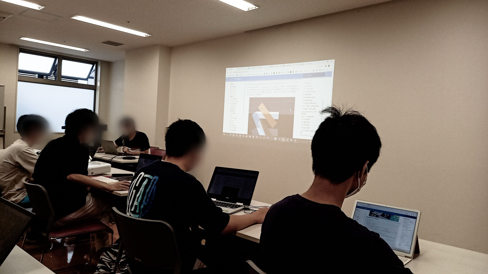
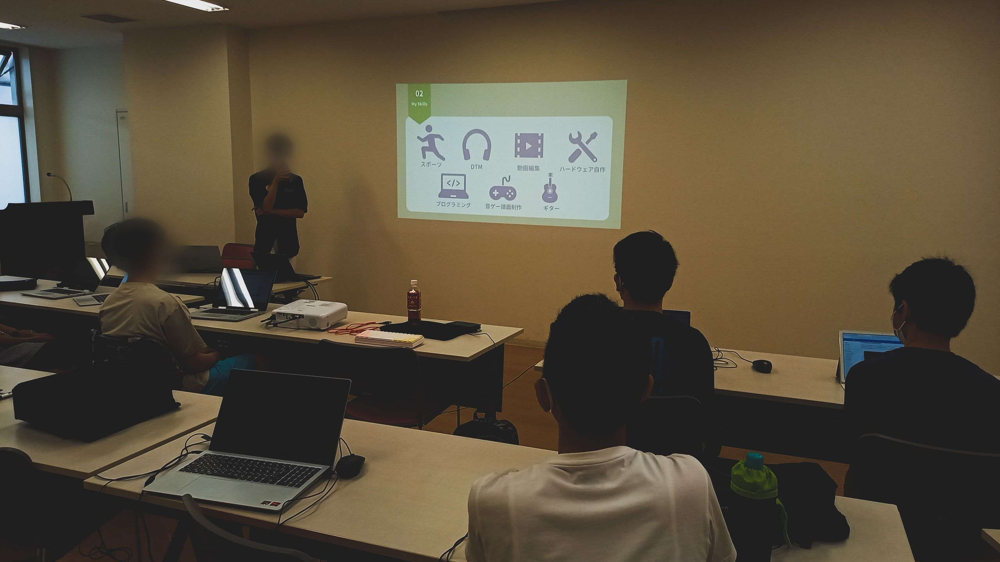

# Siv3D 勉強会 in 古河中等教育学校（2022）

2022 年 8 月 16 日（火曜日）に Siv3D 勉強会を開催しました。
数行～数十行のコードでゲームやメディアアートを作れる C++ フレームワーク「Siv3D」の開発者である鈴木遼さん（[@Reputeless](https://twitter.com/Reputeless)）にお越しいただき、Siv3D の講義をしていただきました。

当日は 2 年次（中学 2 年生）3 名、5 年次（高校 2 年生）4 名の計 7 名が参加しました。

Siv3D のチュートリアルから始まり、Siv3D を用いて制作されたサンプルゲームを楽しんだのち、基本的な機能について学習し、最後は演習としていくつかの課題の中から選択して、各々コーティングを行いました。自分でカスタマイズした機能を実装したり、独自のプログラムを書く部員もいたようです。
また、講師の方に Siv3D に関する質問を直接することができるなど、非常に魅力的な会となりました。

# LT

勉強会中盤で部員 2 名による LT も実施しました。一人は部活紹介、ならびに今後の活動の計画を、もう一名は Zig 言語について LT を行いました。

# 最後に

KSS PC Club においてこのような勉強会を実施するのは創設以来初めてのことでした。とても楽しむことができ、有意義な時間でした。Siv3D を使用したゲームで文化祭展示を盛り上げていければと考えています。講師の鈴木さん、ありがとうございました。

# Siv3D に関するリンク

- [公式ホームページ](https://siv3d.github.io/ja-jp/)
- [GitHub リポジトリ](https://github.com/Siv3D/OpenSiv3D)
